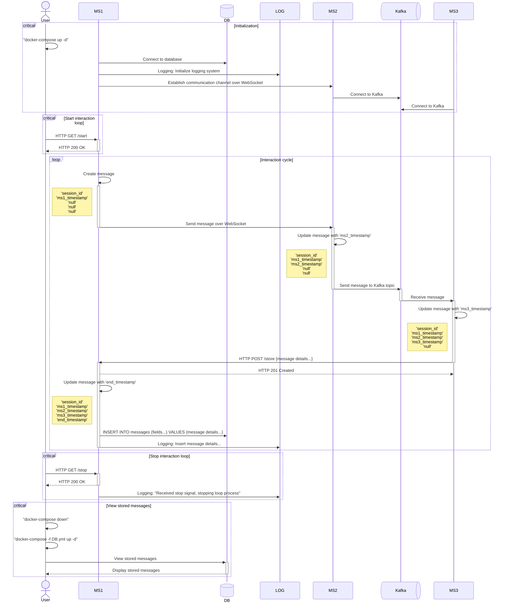

# Test task for Java Dev 

## Microservices Interaction

Three microservices (MS1, MS2, MS3) interact with each other by message like this:

```json
{
	“session_id”: integer,
	“ms1_timestamp”: datetime,
	“ms2_timestamp”: datetime,
	“ms3_timestamp”: datetime,
	“end_timestamp”: datetime
}
```

### Reqirements

1. Use only LTS versions of Java, Spring Boot and other dependencies.
2. Use Docker for containerization of microservices and database.
3. Use WebSocket for communication between MS1 and MS2.
4. Use Kafka for communication between MS2 and MS3.
5. Use a relational database (e.g., MySQL, PostgreSQL) for storing messages in MS1.
6. The database must remain accessible for viewing after the containers have been stopped.
7. The interaction cycle duration is determined by the configuration of MS1.

### Init, Start and Stop the Loop Interaction

Use some UML tool for rendering this code (for example, https://www.planttext.com):

```wsd
@startuml
title Microservices Interaction Sequence Diagram

actor User
participant MS1
database DB
participant LOG #99FF99
participant MS2
queue Kafka
participant MS3

== Initialization ==

User -> User: "docker-compose up -d"
MS1 -> DB: Connect to database
MS1 -> LOG: Logging: Initialize logging system
MS1 -> MS2: Establish communication channel over WebSocket
MS2 -> Kafka: Connect to Kafka
MS3 -> Kafka: Connect to Kafka

== Start interaction loop ==

User -> MS1: HTTP GET /start
MS1 --> User: HTTP 200 OK

== Loop interaction ==

MS1 -> MS1: Create message
note left: 'session_id'\n'ms1_timestamp'\n'null'\n'null'\n'null'

MS1 -> MS2: Send message over WebSocket

MS2 -> MS2: Update message with 'ms2_timestamp'
note left: 'session_id'\n'ms1_timestamp'\n'ms2_timestamp'\n'null'\n'null'

MS2 -> Kafka: Send message to Kafka topic
Kafka -> MS3: Receive message

MS3 -> MS3: Update message with 'ms3_timestamp'
note left: 'session_id'\n'ms1_timestamp'\n'ms2_timestamp'\n'ms3_timestamp'\n'null'

MS3 -> MS1: HTTP POST /store {message details...}
MS1 --> MS3: HTTP 201 Created

MS1 -> MS1: Update message with 'end_timestamp'
note left: 'session_id'\n'ms1_timestamp'\n'ms2_timestamp'\n'ms3_timestamp'\n'end_timestamp'

MS1 -> DB: INSERT INTO messages (fields...) VALUES (message details...)
MS1 -> LOG: Logging: Insert message details...

== Stop interaction loop ==

User -> MS1: HTTP GET /stop
MS1 --> User: HTTP 200 OK
MS1 -> LOG: Logging: "Received stop signal, stopping loop process"
User -> User: "docker-compose down"

== View stored messages ==

User -> User: "docker-compose -f DB.yml up -d"
User -> DB: View stored messages
DB --> User: Display stored messages
@enduml

```

See full UML in file `sequence.wsd`

### Mermaid diagram for microservices interaction:


